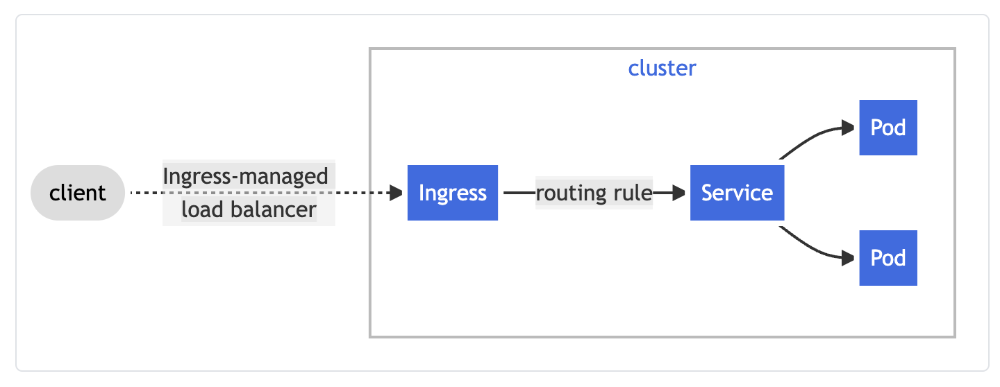

# Summary

This repo is to help deploy an ingress controller to your EKS cluster in AWS 




Dependencies

- aws-cli
- eksctl
- kubernetes
- helm


# Install kubectl and helm
```
sudo snap install helm --classic

sudo snap install kubectl --classic
```

# Install eksctl on your architecture
for ARM systems, set ARCH to: `arm64`, `armv6` or `armv7`
```
ARCH=arm64
PLATFORM=$(uname -s)_$ARCH

curl -sLO "https://github.com/weaveworks/eksctl/releases/latest/download/eksctl_$PLATFORM.tar.gz"

curl -sL "https://github.com/weaveworks/eksctl/releases/latest/download/eksctl_checksums.txt" | grep $PLATFORM | sha256sum --check

tar -xzf eksctl_$PLATFORM.tar.gz -C /tmp && rm eksctl_$PLATFORM.tar.gz 

sudo mv /tmp/eksctl /usr/local/bin

```

# Install aws-cli

```
curl "https://awscli.amazonaws.com/awscli-exe-linux-aarch64.zip" -o "awscliv2.zip"

sudo apt install unzip

unzip awscliv2.zip

sudo ./aws/install --bin-dir /usr/bin --install-dir /usr/aws-cli --update

aws --version

aws configure
```

# Create EKS Cluster
```
eksctl create cluster demo
```

# Add Ingress Controller to Cluster

```
helm repo add ingress-nginx https://kubernetes.github.io/ingress-nginx

kubectl create namespace nginx-ingress 

helm install ingress-nginx ingress-nginx/ingress-nginx -n nginx-ingress

kubectl get svc
```


# Deploy Pods

```
kubectl apply -f ./deployments/deployment-foo.yaml
kubectl apply -f ./deployments/deployment-bar.yaml
```

# Deploy Ingress service to route traffic to pods
```
kubectl apply -f ./deployments/ingress.yaml
```

Now these two services are reachable is reachable at:

- https://load-balancer.com/foo
- https://load-balancer.com/bar


# Clean Up Cluster

```
eksctl delete cluster demo
```

